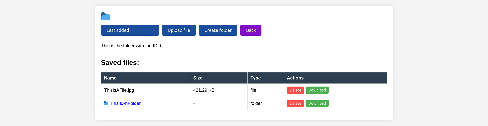

# ONLINEDATABASE

A self-developed local database for storing data in a file-based structure.


## Technologies Used

Backend: C++ with SQLite for database interaction

Frontend: HTML, CSS, and JavaScript for the user interface

## Features

- Lightweight and easy to use
- Stores data in a structured file format
- No external database dependencies
- Local access for fast performance



- You can save, rename, sort, and delete files, as well as create new folders in the database. Please note that deleting a folder will also delete all files and subfolders contained within it

## Directory Structure

- **Api-Back/** → Backend with API server
- **Front/** → Frontend with HTML files

## Installation & Execution

### 1️⃣ Start the Backend

Navigate to the `Api-Back` directory:

```sh
cd Api-Back
```

Run the backend service:

```sh
./api_server
```

If `./api_server` does not exist, compile it first:

```sh
g++ -std=c++17 -I/usr/include/jsoncpp api.cpp -o api_server -lpthread -lsqlite3 -ljsoncpp
```

### 2️⃣ Start the Frontend

```sh
cd Front
```

Start a local server:

```sh
python3 -m http.server 5500
```
